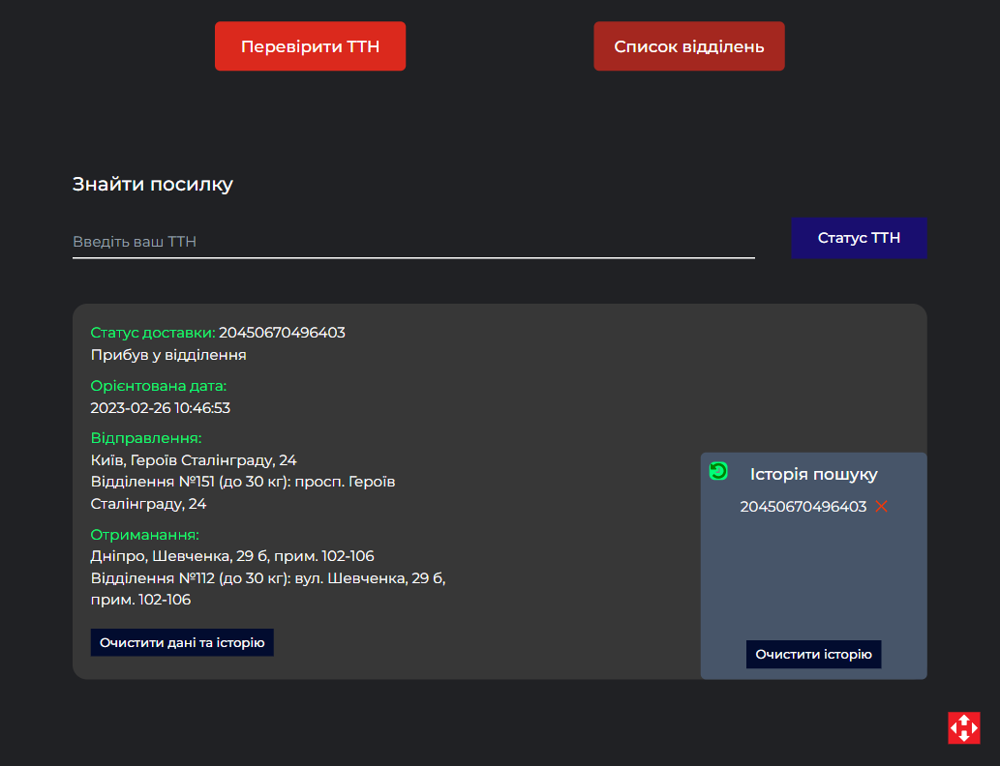
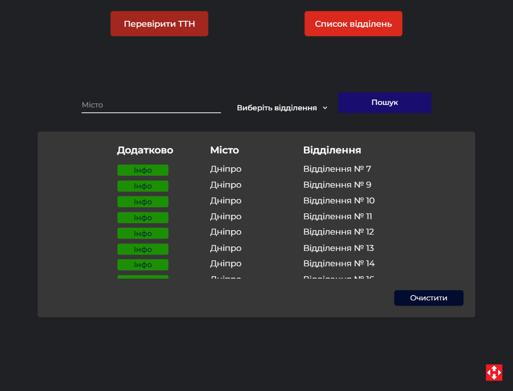
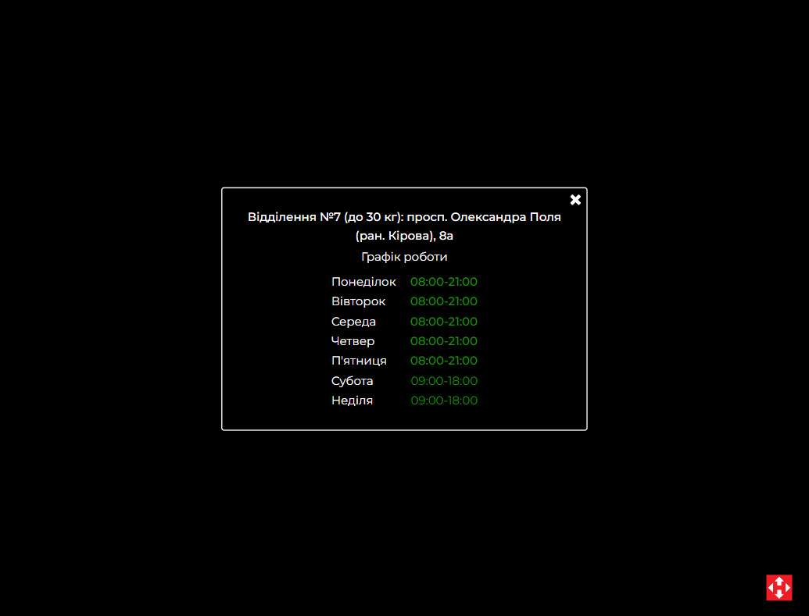

Нова пошта Тестовий проект.

Технологіі:

1. React (hooks / component / router)
2. RTK / RTK-Query
3. Redux-Persist
4. Typescript
5. Tailwindcss
6. Scss
7. Formik/yup
8. Netlify deploy

ТЗ:

https://docs.google.com/presentation/d/15oK22tFriVDsx-7xFrPkfdmADFyb-UIuJNQ8Qo8Uw94/edit#slide=id.p

По часу та більш складному тз:

Не вказано часу скільки робити Тестове, немає можливості звязатися з компанією, уточнити виникші питання по тз. Маю змогу зробити повний бекенд, не працював з Nestjs, але працював з MongoDb Nodejs + (Fastify/Express), знаючи скільки часу є на тестове, зміг би спокійно розібратись, для такого завдання. Дуже поспішав зробити. Тому цей пункт пропустив. Ні сроків ні дати, не можливо додати опис до форми відправки, тому пишу в редмі.

